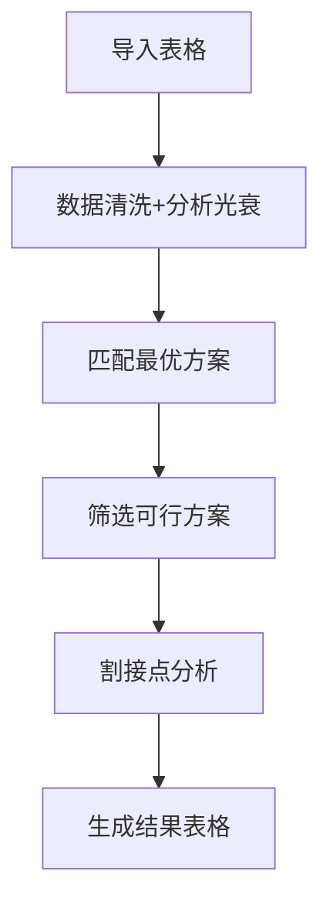
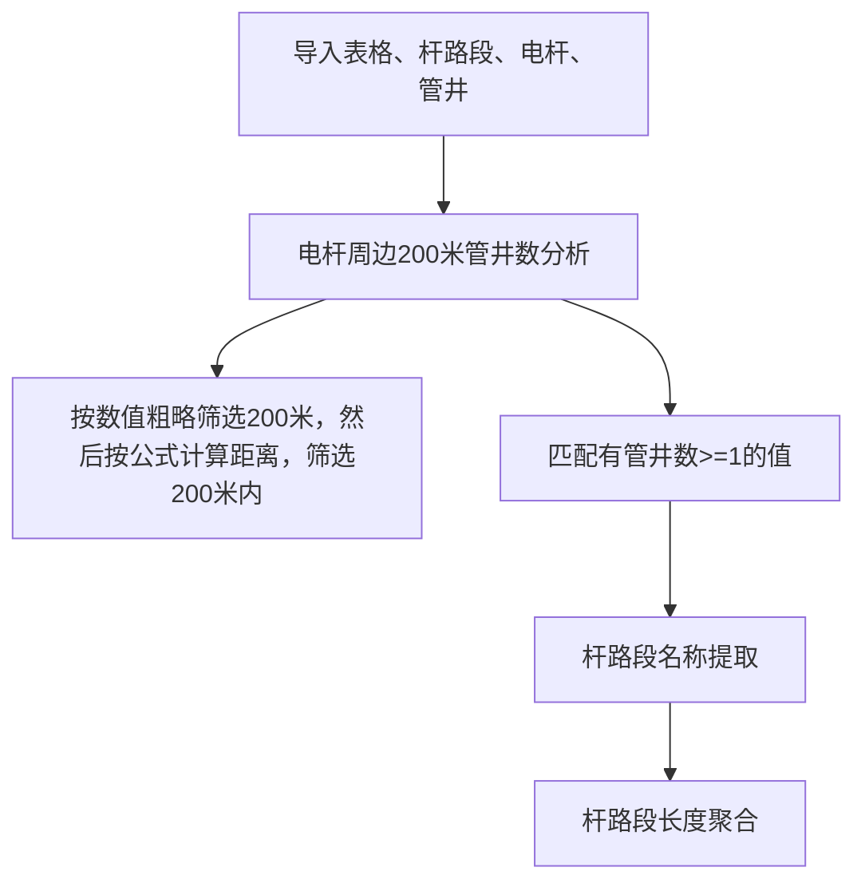

# **弱光整治**
- 限制读取表格的类型为xlsx，同时必须包含以下列：
    - PON口
- 弱光分析方法

- 杆路段落地分析（已有管道部分）

# 导入数据更新需求
- 添加可选框，支持勾选是否选择多个文件
- 添加QSpinBox，支持用户输入导入表格 列名在第几行，默认值为1
- 读取判断输入文件的后缀名是否为xlsx还是CSV，根据后缀名调用不同的读取函数
- 若为CSV文件，需要判断csv文件encoding编码，根据编码调用不同的读取函数
- 新增 管道段、杆路段、电杆、管井的表格导入

# 小工具专题
- 资源图层生成器：管道、杆路、ODF和箱体
- 搬运其他小工具